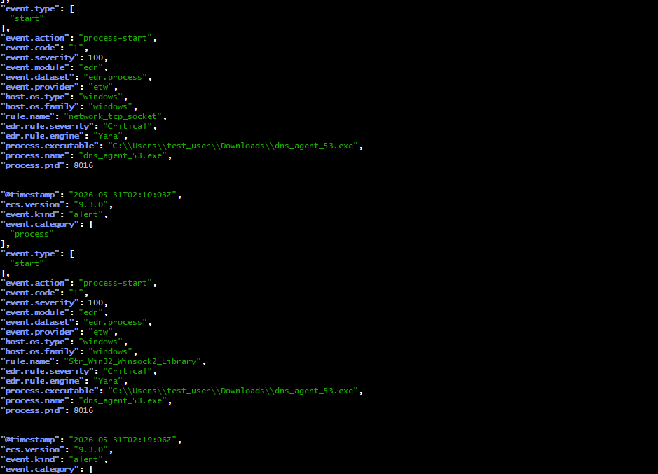
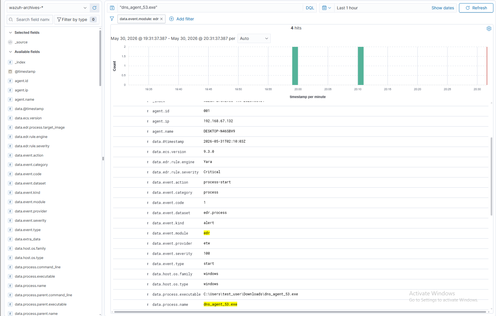
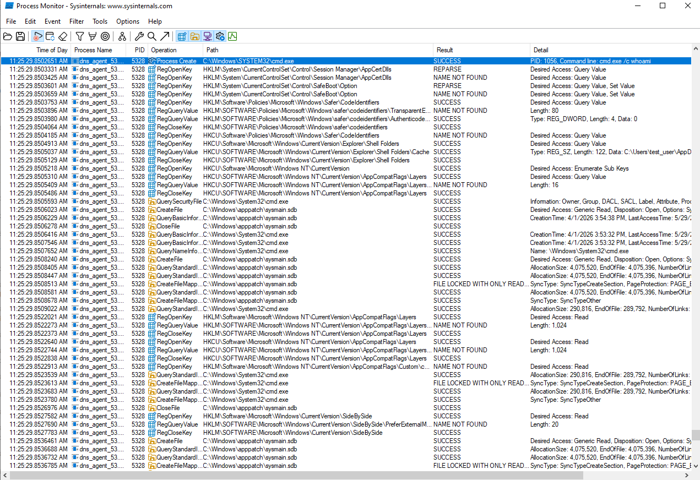

# Evasion: dns_agent_53.exe and loader2.exe

This section covers why `dns_agent_53.exe` was caught immediately by static YARA rules, and how `loader2.exe` was built to bypass every detection layer that caught it.

---

## dns_agent_53.exe — The Raw C2 Implant

`dns_agent_53.exe` is a Windows x64 C implant that communicates via raw DNS TXT records, bypassing the Windows DNS resolver entirely. It opens raw UDP sockets directly to the C2 server and encodes command output in base64 across TXT record chunks.

When executed directly, it was caught immediately by Rustinel's YARA rules at process start via ETW hooks — before it made a single network connection.

### Why YARA Caught It

Two rules fired as Critical the moment the process started:

**`network_tcp_listen`** — matched TCP/socket patterns in the PE's import table at load time. `dns_agent_53.exe` imports `ws2_32.dll` and calls `WSAStartup`, `socket`, `sendto`, `recvfrom` directly.

**`Str_Win32_Winsock2_Library`** — matched `ws2_32.dll` as a literal string in the PE's import descriptor table. Any binary explicitly importing Winsock2 hits this rule.

Both detections were purely static — they fired on import table characteristics, not on network activity. The implant had not made a single DNS query when it was detected.



*Wazuh alerts showing two Critical YARA rule hits on dns_agent_53.exe at PID 8016. Both triggered via ETW at process start.*



*Full ECS event detail in Wazuh showing process metadata, rule attribution, and YARA engine identification.*



*Process Monitor trace of dns_agent_53.exe running. YARA rules fired at process start; this is the execution that triggered both Critical alerts.*

---

## loader2.exe — The Final Payload

`loader2.exe` delivers `dns_agent_53.exe` in-process without triggering any of the static or behavioral detections that caught the raw implant. It ran with **zero alerts** across Defender, Rustinel YARA, and Wazuh.

### Runtime Execution Order

```
1. PEB walk → ntdll base               (no GetModuleHandle, no Win32 API)
2. Indirect syscall init               (SSN harvest + syscall;ret gadget scan)
3. Sandbox / environment checks        (PEB debugger flags, uptime, KUSER_SHARED_DATA)
4. ETW blind                           (EtwEventWrite* → 0xC3 in ntdll)
5. AMSI blind                          (AmsiScanBuffer/String → 0xC3)
6. ~3-minute CPU prelude               (CRC32 → Monte Carlo π → cursor delta check)
7. RC4 decrypt embedded payload        (split key XOR'd at runtime)
8. Dispatch by magic bytes             (PE → reflective load | COFF → bof_exec | shellcode)
9. dns_agent_bof.c                     (DNS-over-TCP C2 loop)
```

### Why YARA Missed It

The YARA rules that caught `dns_agent_53.exe` target Winsock import strings and socket patterns in the PE at load time. `loader2.exe` has none of this surface:

- **COFF payload, not a PE** — no `MZ` magic, no PE structure, no `ws2_32.dll` import table anywhere in the binary. Winsock is resolved at runtime by the COFF inner loader after the prelude completes.
- **XOR string table** — all sensitive names (`ntdll.dll`, `EtwEventWrite`, `AmsiScanBuffer`, `ws2_32.dll`) are XOR-encoded at build time via `mangle.py` (SKEY=0x5A) and decoded to stack-local buffers at runtime. `strings`, FLOSS, and YARA string scanners find zero plaintext DLL or function names anywhere in the binary.
- **RC4-encrypted payload** — the embedded dns_agent COFF in `.data` is RC4 ciphertext with a split key (two halves XOR'd at runtime, neither alone is the key). No Winsock strings, no PE headers, no parseable structure on disk.

### Why Defender Missed It

| Layer | Why It Missed |
|---|---|
| Static scanner | No CRT startup code, minimal IAT (`ExitProcess`, `LoadLibraryA`, `GetProcAddress`, `GetTickCount`, `GetCursorPos`), COFF payload not parseable as PE |
| Behavioral ML (`!ml`) | ETW blinded (`EtwEventWrite*` → `ret`) before any allocation; ML model receives zero telemetry for subsequent `NtAllocateVirtualMemory`/`NtProtectVirtualMemory` calls. ~3-min prelude also outlasts sandbox analysis windows |
| AMSI | `AmsiScanBuffer` and `AmsiScanString` patched to `ret` before COFF execution |

### Key Evasion Techniques

**No CRT / custom entry point** — linked with `-nostartfiles -nodefaultlibs -Wl,--entry=loader_start`. No `_start`, no CRT heap init, no startup hooks. The OS jumps directly to `loader_start`.

**PEB walk for ntdll** — resolves ntdll base via `GS:0x60` → PEB → `PEB_LDR_DATA.InLoadOrderModuleList`, comparing Unicode `BaseDllName`. No `GetModuleHandleA`, no Win32 API call of any kind before indirect syscall init.

**Environment / anti-debug checks** — `env_ok()` reads four indicators before any payload activity:

| Check | Location | Action |
|---|---|---|
| `PEB.BeingDebugged` | `GS:60h + 2` | Non-zero → exit |
| `PEB.NtGlobalFlag` | `GS:60h + 0xBC` | Bits `0x70` set (WinDbg/sandbox heap flags) → exit |
| `KUSER_SHARED_DATA.KdDebuggerEnabled` | `0x7FFE0000 + 0x2D0` | Bit 0 set → exit |
| System uptime | `GetTickCount()` | < 5 min → exit (defeats fresh-snapshot sandboxes) |

**Indirect syscalls** — custom `indirect.S` stubs with Hell's Gate SSN harvesting. Each stub sets `rax` to the SSN (scanned directly from the ntdll function body, past any hook trampoline) and jumps to a `syscall; ret` gadget inside ntdll. The `syscall` instruction is never in the loader's own `.text`. All memory operations (`NtAllocateVirtualMemory`, `NtProtectVirtualMemory`, `NtFreeVirtualMemory`) use these stubs — zero Nt* imports in the IAT.

**ETW + AMSI blinding** — `EtwEventWrite`, `EtwEventWriteFull`, `EtwEventWriteEx`, `AmsiScanBuffer`, and `AmsiScanString` are each patched to `0xC3` (`ret`) using `NtProtectVirtualMemory` (indirect syscall) before any allocation or decryption. All function names resolved at runtime from the XOR string table.

**~3-minute CPU prelude** — three stages before any allocation or decryption:
1. CRC32 (~1 min): 2048-pass CRC32 rounds over a 512-byte buffer — resembles legitimate file hashing
2. Monte Carlo π (~2 min): Splitmix64 PRNG generating random (x, y) pairs, counting hits inside the unit circle — pure integer arithmetic, no I/O
3. Cursor delta check: samples cursor position 200 ms apart; if cursor is frozen AND `GetTickCount` reports < 5 seconds elapsed (time-acceleration), exits immediately

Sandboxes cannot speed up actual CPU arithmetic. A sandbox with a 2-minute analysis window never reaches decryption. Time-accelerated sandboxes that do survive the clock check fail the cursor test.

**Payload dispatch by magic bytes** — first two bytes of the decrypted buffer determine execution path: `MZ` (0x5A4D) → reflective PE loader, COFF Machine `0x8664` → `bof_exec`, anything else → raw shellcode. Loader2 carried `dns_agent.o` as an x64 COFF.

**PE header wipe** — after reflective load, the first page of the mapped image is zeroed, erasing `MZ`/`PE` from memory.

**VEH + setjmp crash recovery** — secondary BOFs run inside a `AddVectoredExceptionHandler` + `__builtin_setjmp` frame inside `dns_agent_bof.c`. A faulting BOF `longjmp`s back to the agent loop rather than propagating as an unhandled exception.

See [loader2-source-reference.md](loader2-source-reference.md) for the complete technical reference including source-level detail on all components.
