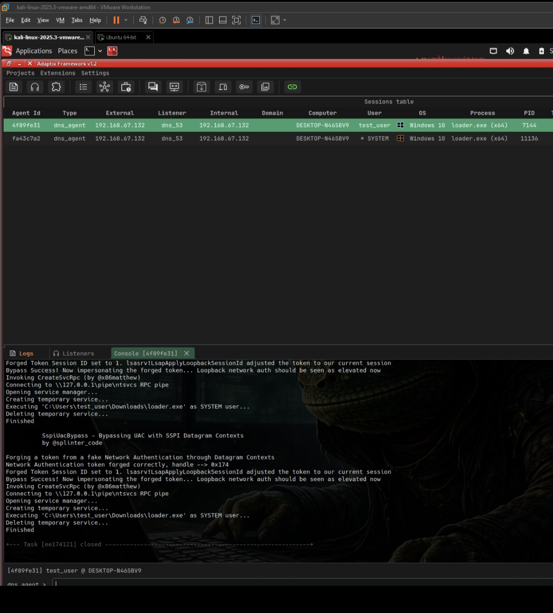

# Detection and Logging Analysis

## Defensive Stack

The lab ran three concurrent defensive layers on the Windows 10 target:

| Layer | Tool | Detection Method |
|---|---|---|
| AV/EDR | Microsoft Defender | Static scanning, behavioral ML (`!ml`), signature rules |
| YARA EDR | Rustinel (Rust-based) | YARA rules triggered via ETW process-start events |
| SIEM | Wazuh | Event collection from Defender, Sysmon, and Rustinel |

---

## What Rustinel Caught: dns_agent_53.exe via YARA

When `dns_agent_53.exe` was executed directly (no loader), Rustinel detected it immediately via two YARA rules triggered at process start through ETW hooks.

### Alert 1: network_tcp_listen

```json
"rule.name": "network_tcp_listen",
"edr.rule.severity": "Critical",
"edr.rule.engine": "Yara",
"process.executable": "C:\\Users\\test_user\\Downloads\\dns_agent_53.exe",
"process.name": "dns_agent_53.exe",
"process.pid": 8016
```

**Why it fired:** `dns_agent_53.exe` imports `ws2_32.dll` and calls `WSAStartup`, `socket`, `sendto`, `recvfrom`. The YARA rule matches on TCP/socket-related patterns visible in the PE's import table and string section at load time — before the process executes a single instruction.

### Alert 2: Str_Win32_Winsock2_Library

```json
"rule.name": "Str_Win32_Winsock2_Library",
"edr.rule.severity": "Critical",
"edr.rule.engine": "Yara",
"process.executable": "C:\\Users\\test_user\\Downloads\\dns_agent_53.exe",
"process.pid": 8016
```

**Why it fired:** `ws2_32.dll` appears as a literal string in the PE's import descriptor table. The YARA rule matches this string directly. This is a basic static signature that hits on any binary explicitly importing Winsock2.

Both alerts were collected by Wazuh with `event.severity: 100` and forwarded to the SIEM in ECS format.


*Wazuh alerts showing two Critical YARA rule hits on dns_agent_53.exe at PID 8016. Both triggered via ETW at process start.*


*Full ECS event detail in Wazuh showing process metadata, rule attribution, and YARA engine identification.*

**Key insight:** both detections were purely static — they fired on PE import table characteristics, not on any network activity or behavioral indicator. The implant had not made a single DNS query when it was detected.

---

## What Wasn't Caught: loader_evade.exe — Zero Alerts

`loader_evade.exe` executed on the same system with the same defensive stack active and generated **zero alerts** across all three layers.

### Why Rustinel's YARA Rules Missed It

The YARA rules that caught `dns_agent_53.exe` target:
- Winsock string references (`ws2_32.dll`, `WSAStartup`, `Str_Win32_Winsock2_Library`)
- Socket pattern imports (`network_tcp_listen`)

`loader_evade.exe` has none of these. Its IAT contains only `ExitProcess`, `GetProcAddress`, `GetTickCount`, `LoadLibraryA`. The `ws2_32.dll` string never appears anywhere in the binary — Winsock is loaded at runtime by the reflective loader's IAT fixup routine when it resolves imports for the embedded dns_agent PE. By the time Winsock is loaded, YARA rules have already run against the loader binary's static characteristics and found nothing.

The embedded dns_agent payload in `.rdata` is RC4 ciphertext — no Winsock strings, no PE headers, no structure for YARA to parse.

### Why Defender's Static Scanner Missed It

The `VirTool:Win64/MeterBof.A` static detection that caught the first loader targeted the djb2 hash seed `0x1505` combined with the `shl r8d,5; add; xor` inner loop pattern. `loader_evade.exe` uses SysWhispers3 for API resolution — no djb2, no hash function, no constant `0x1505` anywhere in the binary.

The CRT-free build removes all the standard startup code patterns that YARA rules commonly anchor to. The binary looks unlike any known malware family's compiler output.

### Why Defender's Behavioral ML Missed It

`Behavior:Win32/DefenseEvasion.A!ml` is triggered by ETW telemetry. ETW blinding (`blind_etw()`) patches `EtwEventWrite`, `EtwEventWriteFull`, and `EtwEventWriteEx` to `ret` before any allocation or decryption. The ML model receives no events for the subsequent `NtAllocateVirtualMemory`, `NtProtectVirtualMemory`, or memory write operations.

The previous timing check (query-sleep-query) was itself a behavioral indicator. The Monte Carlo replacement uses `GetTickCount` in a legitimate-looking timeout loop — a pattern that appears in thousands of normal applications.

### Why the SSPI UAC Bypass Wasn't Caught

The `uacbybass sspi` BOF executes the James Forshaw SSPI datagram context technique:

```
[Console output from Adaptix session]
SspiUacBypass — Bypassing UAC with SSPI Datagram Contexts
by @splinter_code

Forging a fake Network Authentication through Datagram Contexts
Network Authentication token forged correctly, handle --> 0x174
Forged Token Session ID set to 1. lsasrv!LsapApplyLoopbackSessionId adjusted...
Bypass Success! Now impersonating the forged token...
Invoking CreateSvcRpc (by @x86matthew)
Connecting to \\127.0.0.1\pipe\ntsvcs RPC pipe
Opening service manager...
Creating temporary service...
Executing 'C:\Users\test_user\Downloads\loader.exe' as SYSTEM user...
Deleting temporary service...
Finished
```

No registry writes. No auto-elevating binary launch. All operations occur within LSASS's normal SSPI processing path via loopback RPC. Defender's behavioral engine had no rule for this specific abuse at the installed intelligence version.



*Adaptix sessions table showing two dns_agent sessions: initial test_user beacon (agent 4f89fe31) and the SYSTEM beacon (agent fa43c7a2) spawned by the SSPI bypass. Console log shows full bypass output.*

---

## Detection Comparison Table

| Action | Tool | Result | Why |
|---|---|---|---|
| `dns_agent_53.exe` executed directly | Rustinel YARA | **Caught** | Winsock import strings in PE |
| `dns_agent_53.exe` executed directly | Rustinel YARA | **Caught** | `network_tcp_listen` import pattern |
| `loader_evade.exe` executed | Rustinel YARA | **Missed** | No Winsock strings, RC4-encrypted payload |
| `loader_evade.exe` executed | Defender static | **Missed** | No djb2, no CRT patterns, minimal IAT |
| `loader_evade.exe` behavioral | Defender ML | **Missed** | ETW blinded, Monte Carlo prelude |
| `uacbybass regshellcmd` BOF | Defender behavioral | **Caught** | `Behavior:Win32/UACBypassExp.gen!G` |
| `uacbybass sspi` BOF | Defender behavioral | **Missed** | No behavioral rule for SSPI technique |
| `getsystem token` BOF | Defender + Wazuh | **Missed** | In-process token manipulation, no new process |
| Credential dump BOF | Defender + Wazuh | **Missed** | In-process COFF, no LSASS memory dump file |
| DNS C2 beaconing | Wazuh / network | **Present** | Hard to catch outbound |

---

## Logging Artifacts

### Wazuh

Wazuh captured the two YARA alerts from Rustinel for the direct dns_agent execution. For `loader_evade.exe`: no alerts. The DNS C2 channel produced no alerts from any log source — UDP port 53 traffic is not inspected for C2 characteristics by default.

### Sysmon

Sysmon was active and logging process creation, network events, and registry changes. The `uacbybass regshellcmd` attempt left a registry event for `HKCU\ms-settings\shell\open\command`. The SSPI bypass produced a service installation event (temporary service created then immediately deleted by the BOF cleanup). Both of these appeared in Sysmon logs and were forwarded to Wazuh — but did not generate actionable alerts at the SIEM layer because no tuned correlation rules existed for these specific patterns.

### Process Monitor

Process Monitor traced `loader2.exe` at the API call level. The trace showed minimal DLL loads at startup, no calls to high-risk APIs visible in the static load sequence, and no Defender quarantine events during the execution window.

---

## Detection Recommendations

Based on what was missed:

1. **YARA rules on loaded DLLs, not just static PE:** `WS2_32.dll` loaded by a process whose on-disk binary has no Winsock import is a high-confidence anomaly. YARA rules triggered on module-load events (not just process-start) would catch this.

2. **ETW ETWTI for private memory transitions:** the kernel-mode `Microsoft-Windows-Threat-Intelligence` provider fires on `RW→RX` `NtProtectVirtualMemory` calls on private allocations regardless of user-mode ETW patching. Consuming ETWTI events catches reflective PE loading even after ETW blinding.

3. **VAD anomaly detection:** anonymous `VadS` allocations at PE preferred bases (`0x140000000`) with no file backing are strong indicators of reflective loading. Memory scanning for this pattern would have found the loaded dns_agent.

4. **SSPI abuse signatures:** the loopback RPC pipe connection + temporary service creation pattern from a non-service process is a detectable sequence via Sysmon event correlation.

5. **DNS query entropy and frequency analysis:** high-entropy subdomain queries with TXT record responses from an unusual source IP would score as suspicious under a DNS C2 detection model.
